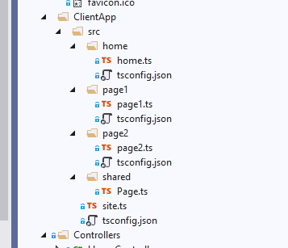
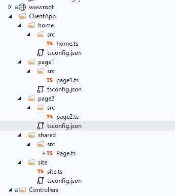

# Initial a ASP DotNetCore MVC Site with  Multiple-SPA Page

DotNetCore, MVC, Multiple page SPA, TypeScript, ReactJs

## 1 Create a Web Application project with DotNetCore MVC and TypeScript

### 1.1 Create a new ASP.NET Core MVC project

In Visual Studio 2019, choose Create a new project in the start window. If the start window is not open, choose File > Start Window. Type web app, choose C# as the language, then choose ASP.NET Core Web Application (Model-View-Controller), and then choose Next. On the next screen, name the project, and then choose Next.

Choose the recommended target framework (.NET Core 3.1) , and then choose Create.

The new site with home page will be created.

### 1.2  Add Typescript follow the steps in below tutorials.

- In the Manage NuGet Packages window, search for Microsoft.TypeScript.MSBuild, and then click Install on the right to install the package.

- My ts.config for building my typescript code  in ClientApp/src folder in to plain js files.

    ```json
        {
            "compileOnSave": true,
            "compilerOptions": {
            "noImplicitAny": false,
            "noEmitOnError": true,
            "removeComments": false,
            "sourceMap": true,
            "target": "es5",
            "outDir": "../wwwroot/js"
            },
            "include": [
            "src/**/*"
            ]
        }   
    ```

### 1.2. Add .gitignore for Visual Studio and DotNetCore solution

My [.gitignore file](.gitignore) for Visual Studio project grab from <https://github.com/github/gitignore>

## 2 Add Multiple Page and add ts for each page

### 2.1 Add multiple controllers and views and add some ts files

- Add some controllers and views.
- In the ClientApp, create folder for each pages. Add some Typescript files there.
    

### 2.2 Connect the View and Javascript files in View

The  code site.ts will used for all site, it need in `Shared/_layout.cshtml` files.
In each pages, they will have their own javascript files.

The js will be include in the view like below:

```html
@{
    ViewData["Title"] = "page1";
}

<h1>page1</h1>

@section Scripts {
    <script src="~/js/page1/page1.js" asp-append-version="true"></script>
}

```

### 2.3 Move Ts.Config to each page JS folder

Since we will build each page as a single page application. they need it's own config.



```json
{
  "compileOnSave": true,
  "compilerOptions": {
    "noImplicitAny": false,
    "noEmitOnError": true,
    "removeComments": false,
    "sourceMap": true,
    "target": "es5",
    "outDir": "../../../wwwroot/js"

  },
  "include": [
    "**/*",
    "../shared/*"
  ],
  "exclude": [
    "node_modules"
  ]
}
```

Also the code need import the module in shared folder

The page.ts in shared folder:

```js
export interface Page {
    Name: string;
    Title: string;
    Desc: string;
    PageId: number;
}
```

The tsconfig.json in Page folder

```json
{
  "compileOnSave": true,
  "compilerOptions": {
    "noImplicitAny": false,
    "noEmitOnError": true,
    "removeComments": false,
    "sourceMap": true,
    "target": "es5",
    "outDir": "../../../wwwroot/js"

  },
  "include": [
    "**/*",
    "../shared/*"
  ],
  "exclude": [
    "node_modules"
  ]
}
```

Pay attention on the *include* and *exclude* section. also the *outDir* need update to the correct relation path.

### 2.4 Re-structure the folder of for the page scripts

Move the Src folder inside the page folder, so we could add config and module files outside the src folder for each pages folder.


### 2.5 Update the ts.config to make one page only use single bundle js file

Example of `tsConfig.json` file  in the Page1 folder.
Add module with 'ADM'
and special the name in the outFile.

```json
{
  "compileOnSave": true,
  "compilerOptions": {
    "noImplicitAny": false,
    "noEmitOnError": true,
    "removeComments": false,
    "sourceMap": true,
    "target": "es5",
    "outDir": "/../../wwwroot/js",
    "module": "AMD",
    "outFile": "../../wwwroot/js/Page1.js"

  },
  "include": [
    "src/**/*",
    "../shared/src/**/*"  ]
  
}
```


## 3 Add NPM packages

### 3.1 Add NPM package files

First is make sure the [Node.Js](https://nodejs.org/en/download/) is installed.

Right-click the project in Solution Explorer and choose Add > New Item. Choose the npm Configuration File, use the default name, and click Add.
`package.json` file will be added.


### reference

- AspNet with TypeScript: <https://docs.microsoft.com/en-us/visualstudio/javascript/tutorial-aspnet-with-typescript?view=vs-2019>
- NPM Package Manage with AspNet Core: <https://docs.microsoft.com/en-us/visualstudio/javascript/npm-package-management?view=vs-2019#aspnet-core-projects>
- github ignore:  <https://github.com/github/gitignore/blob/master/VisualStudio.gitignore>
- tsConfig.json doc:
  - <https://www.typescriptlang.org/docs/handbook/tsconfig-json.html>
  - <https://www.typescriptlang.org/tsconfig>

