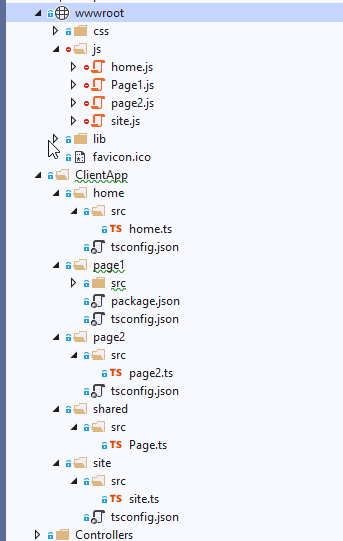

# Initial a ASP DotNetCore MVC Site with  Multiple-SPA Page

DotNetCore, MVC, Multiple page SPA, TypeScript, ReactJs

## 1 Create a Web Application project with DotNetCore MVC and TypeScript

### 1.1 Create a new ASP.NET Core MVC project

In Visual Studio 2019, choose Create a new project in the start window. If the start window is not open, choose File > Start Window. Type web app, choose C# as the language, then choose ASP.NET Core Web Application (Model-View-Controller), and then choose Next. On the next screen, name the project, and then choose Next.

Choose the recommended target framework (.NET Core 3.1) , and then choose Create.

The new site with home page will be created.

### 1.2  Add Typescript follow the steps in below tutorials.

- In the **Manage NuGet Packages** window, search for **Microsoft.TypeScript.MSBuild**, and then click Install on the right to install the package.

- Create folders `/ClientApp/` and `/ClientApp/Src/` for your TypeScript code
- My initial `tsconfig.json` looks like below. It will build my typescript code  in ClientApp/src folder in to plain js files and output to `/wwwroot/js` folder.

    ```json
        {
            "compileOnSave": true,
            "compilerOptions": {
            "noImplicitAny": false,
            "noEmitOnError": true,
            "removeComments": false,
            "sourceMap": true,
            "target": "es5",
            "outDir": "../wwwroot/js"
            },
            "include": [
            "src/**/*"
            ]
        }   
    ```

### 1.2. Add .gitignore for Visual Studio and DotNetCore solution

The ignore configuration file [.gitignore file](.gitignore) for Visual Studio project grab from <https://github.com/github/gitignore>, add to the solution root.

This project using '/wwwroot/js' as JavaScript output folder, so add below to `.getignore` file.

`WebApplication/wwwroot/js`

### 1.3 Add TyScript code to the Site home page

Add some typescript code to the ClientApp and included in the default home view come with the project template.

```typescript
//home.ts
function TSButton() {
    let name: string = "Fred";
    document.getElementById("ts-example").innerHTML = greeter(user);
}

class Student implements Person {
    fullName: string;
    constructor(public firstName: string, public middleInitial: string, public lastName: string) {
        this.fullName = firstName + " " + middleInitial + " " + lastName;
    }
}

interface Person {
    firstName: string;
    lastName: string;
}

function greeter(person: Person) {
    return "Hello, " + person.firstName + " " + person.firstName;
}

let user = new Student("Fred", "M.", "Smith");

```

```csharp
// /Views/home/index.cshtml
<div id="ts-example">
    <br />
    <button type="button" class="btn btn-primary btn-md" onclick="TSButton()">
        Click Me
    </button>

</div>

@section Scripts {
    <script src="~/js/home.js" asp-append-version="true"></script>
}
```

In VS2019, run the application in IIS Express, the new web site with TypeScript will working.

Please see more details on the [reference tutorial](https://docs.microsoft.com/en-us/visualstudio/javascript/tutorial-aspnet-with-typescript?view=vs-2019)

## 2 Add Multiple Page and add ts for each page

### 2.1 Add multiple controllers and views and add some ts files

- Add some controllers and views.
- In the ClientApp, create folder for each pages. Add some Typescript files there.
- The final project solution explorer view will looks like below
    


### 2.2 TsConfig.json for multiple pages with shared modules

The there is shared folder, we have `site.ts` will used by multiple page, and we want build the single js page for each page.

In the project we use javascript module type [AMD](https://en.wikipedia.org/wiki/Asynchronous_module_definition).
and it need use [requireJs](https://requirejs.org/).

download the [required.js](https://requirejs.org/docs/download.html) and put in the `\wwwroot\lib\` folder.

Example of `tyConfig.json` for `/page1/`:

```json
{
  "compileOnSave": true,
  "compilerOptions": {
    "noImplicitAny": false,
    "noEmitOnError": true,
    "removeComments": false,
    "sourceMap": true,
    "target": "es5",
    "outDir": "/../../wwwroot/js",
    "module": "AMD",
    "outFile": "../../wwwroot/js/Page1.js"
  },
  "include": [
    "src/**/*",
    "../shared/src/**/*"
  ]  
}
```

Pay attention on the *include* and *exclude* section. also the *outFile* need update to the correct relation path.
`outFile` will build all ts files in the folder into one js file, and only works with module `AMD` and `System`

For documentation of tsconfig setting, please check <https://www.typescriptlang.org/tsconfig>

### 2.3 Connect the View and Javascript files in View

The  code site.ts will used for all site, it need in `Shared/_layout.cshtml` files.

```csharp
    <!-- and the bottom of Shared/_layout.cshtml -->
    <script src="~/lib/jquery/dist/jquery.min.js"></script>
    <script src="~/lib/bootstrap/dist/js/bootstrap.bundle.min.js"></script>
    <script src="~/js/site.js" asp-append-version="true"></script>    
    @RenderSection("Scripts", required: false)
```

In each pages, the js will be include in the view like below:

```html
@{
    ViewData["Title"] = "page1";
}

<h1>page1</h1>

@section Scripts {

    <script data-main="/js/page1.js" src="~/lib/require.js" asp-append-version="true"></script>
    <script>
       require(["page1/src/page1"])
    </script>
}

```

*Note: the `page1.js` is exported as module name `page1/src/page1` since it use module in `shared/src/page`. the Script `require(["page1/src/page1"])` will load the javascript code and run it*

## 3 Add a new page ReactDemo to Demo how to integrate ReactJs with TypeScript

### 3.1 Add NPM package

NPM is come with the [Node.Js](https://nodejs.org/en/download/). It should already be installed before you working this TypScript project.

Right-click the project in Solution Explorer and choose Add > New Item. Choose the npm Configuration File, use the default name, and click Add.
`package.json` file will be added.

### 3.2 Add ReactJs

please check the source code
todo..

### reference

- AspNet with TypeScript: <https://docs.microsoft.com/en-us/visualstudio/javascript/tutorial-aspnet-with-typescript?view=vs-2019>
- NPM Package Manage with AspNet Core: <https://docs.microsoft.com/en-us/visualstudio/javascript/npm-package-management?view=vs-2019#aspnet-core-projects>
- github ignore:  <https://github.com/github/gitignore/blob/master/VisualStudio.gitignore>
- tsConfig.json doc:
  - <https://www.typescriptlang.org/docs/handbook/tsconfig-json.html>
  - <https://www.typescriptlang.org/tsconfig>

